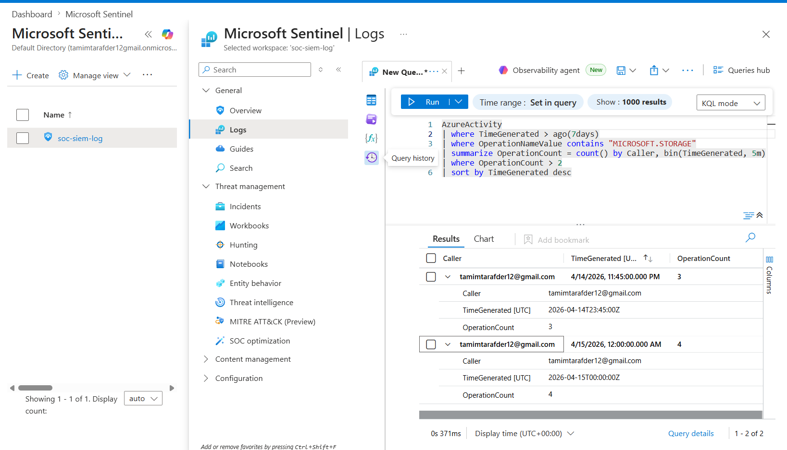
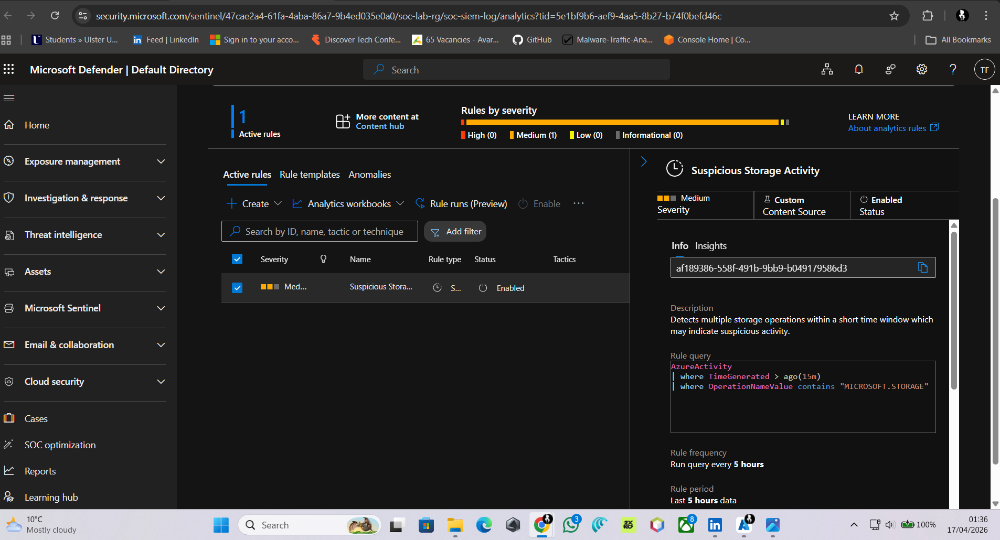
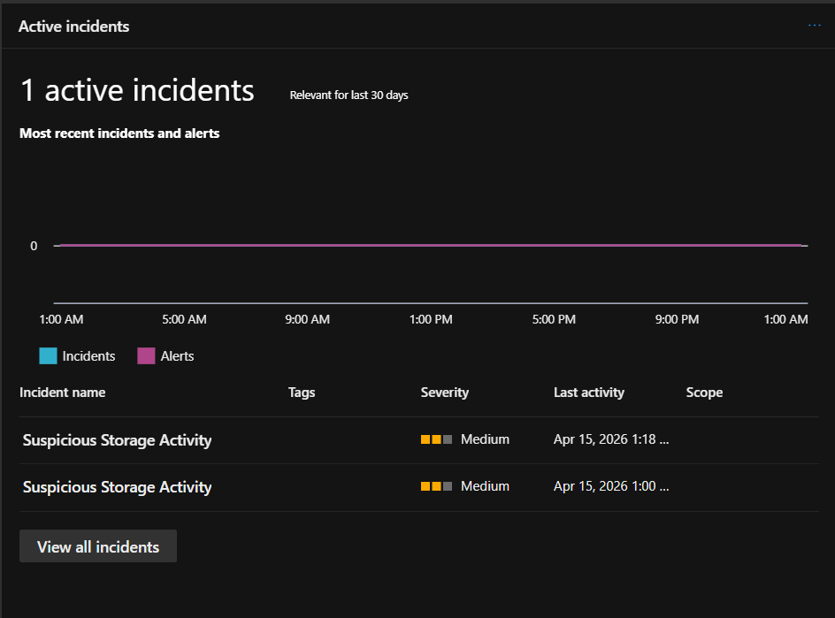
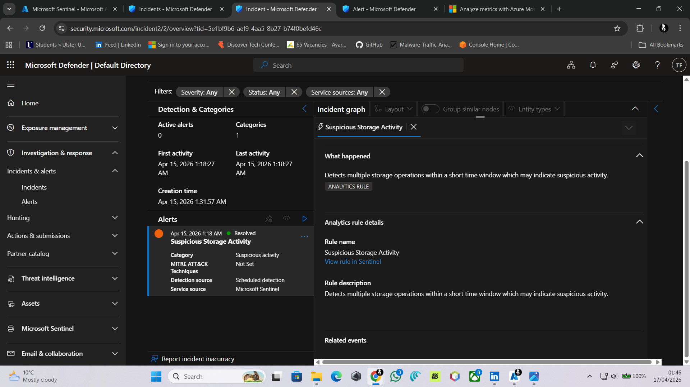

# Microsoft Sentinel SIEM Lab – Detection & Incident Response

## 📌 Overview
This project demonstrates the implementation of a cloud-based Security Information and Event Management (SIEM) system using Microsoft Sentinel. The objective was to ingest Azure Activity logs, detect suspicious behaviour using KQL queries, and perform a full incident response workflow.

---

## 🛠️ Technologies Used
- Microsoft Sentinel (SIEM)
- Azure Log Analytics Workspace
- Azure Storage Account
- Kusto Query Language (KQL)

---

## 🧱 Architecture
- Azure Activity Logs were collected and sent to Log Analytics via diagnostic settings
- Microsoft Sentinel was enabled on the workspace
- Data ingestion pipeline established from Azure to Sentinel
- Detection rules created using KQL
- Alerts and incidents generated and investigated

---

## 🔍 Detection Use Case
A suspicious behaviour scenario was simulated by performing multiple storage operations (uploading and deleting files) within a short timeframe. This behaviour was treated as potential abnormal activity.

---

## 🚨 Detection Rule (KQL)

```kql

AzureActivity
| where TimeGenerated > ago(15m)
| where OperationNameValue contains "MICROSOFT.STORAGE"
| summarize count() by Caller
| where count_ > 2
...
```


🧪 Simulation
Created a storage container
Uploaded and deleted files repeatedly within a short time window
Generated multiple Azure Activity logs
Triggered detection rule based on abnormal activity frequency.

🚨 Alert & Incident Workflow
Scheduled analytics rule created in Microsoft Sentinel
Alert triggered based on detection query
Incident automatically generated
Incident assigned and investigated

🔎 Investigation
Reviewed alert details including user (Caller) and activity timeline
Verified that actions were performed within a short timeframe
Confirmed behaviour matched detection criteria.


📝 Incident Response
Incident assigned to analyst
Status updated to "In Progress"
Investigation findings documented
Incident closed as Benign / False Positive (test scenario).

## 📸 Screenshots

### 🔍 Log Query Results


### 🚨 Detection Rule


### 📊 Incident Dashboard


### 🧪 Investigation Details


Logs query results
Detection rule configuration
Incident dashboard
Incident investigation details
✅ Outcome

Successfully built a functional SIEM environment in Microsoft Sentinel and demonstrated:

Log ingestion
Detection rule creation
Alert generation
Incident investigation and response.

📈 Skills Demonstrated
SIEM configuration and management
Cloud security monitoring
Log analysis and correlation
KQL query development
Incident response workflow
Security event investigation
